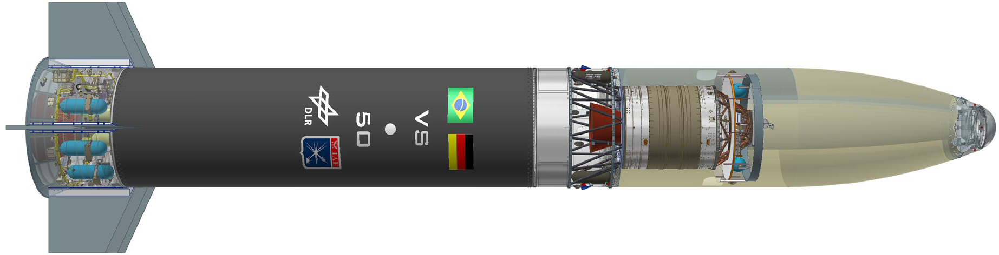
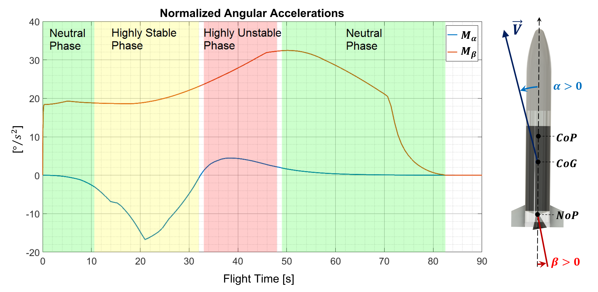
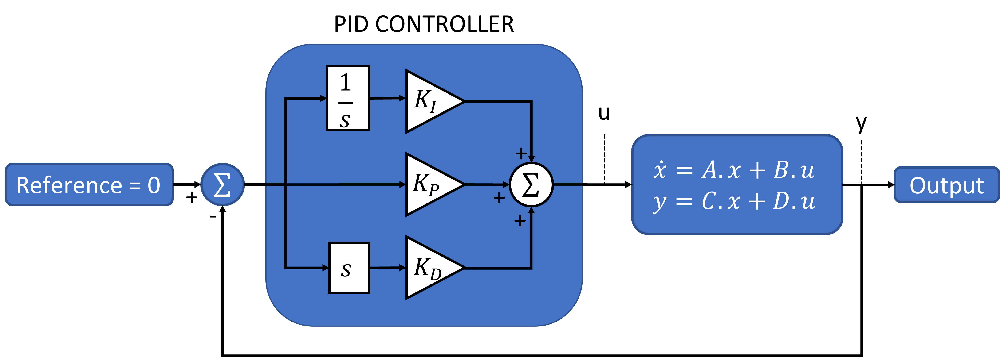
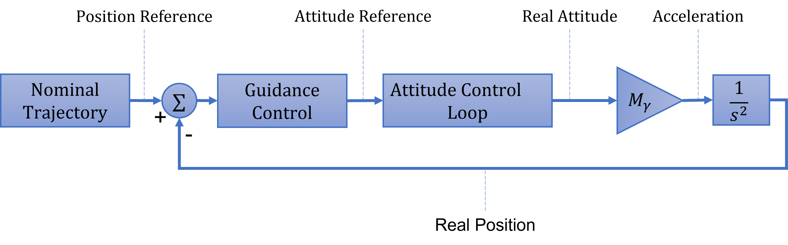
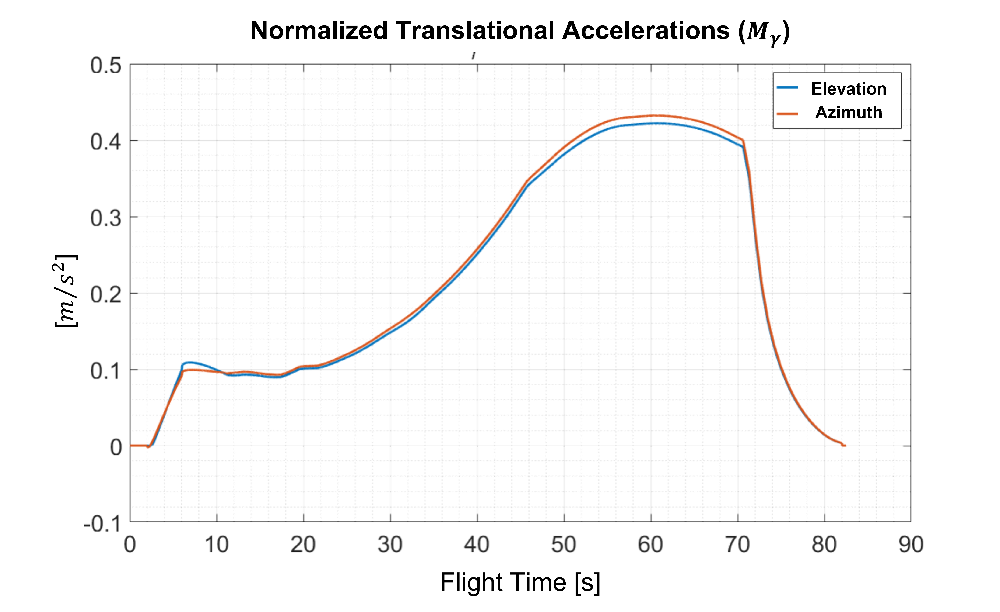
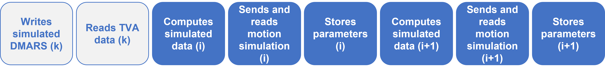
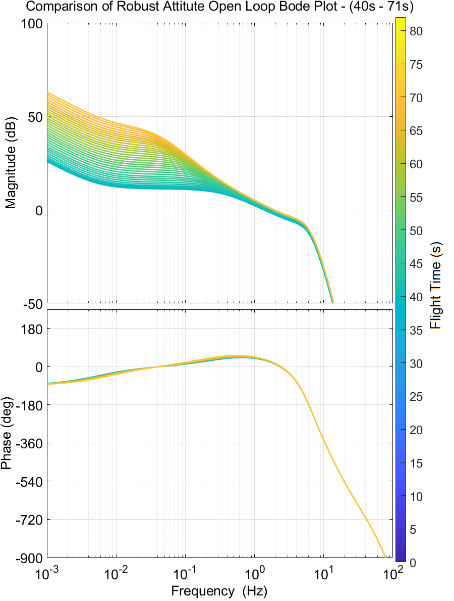

# Supplementary Material Repository

## Robust Attitude and Guidance Control for a Launch Vehicle System: A Lyapunov-LMI Framework with HIL Validation

This repository contains supplementary material for the journal paper:

**"Robust Attitude and Guidance Control for a Launch Vehicle System: A Lyapunov-LMI Framework with HIL Validation"**

**Authors:** Roberto Brusnicki (TUM), Cesar Batagini (IAE), Josef Ettl (DLR), Renan Lima Pereira (ITA)  
**Journal:** International Journal of Aeronautical and Space Sciences  
**Status:** Under Review  
**Year:** 2025  

## 📋 Repository Overview

This repository provides high-resolution figures, detailed analysis results, and comprehensive technical documentation that could not be included in the journal paper due to space constraints. All materials are organized systematically to complement the published research and provide deeper insights into the methodology and results.

### 🚀 Project Background

The VS-50 is a suborbital launch vehicle developed through Brazilian-German cooperation between IAE (Instituto de Aeronáutica e Espaço) and DLR (Deutsches Zentrum für Luft- und Raumfahrt). This research presents robust control strategies using Linear Matrix Inequality (LMI) synthesis for attitude and guidance control systems, with comprehensive Hardware-in-the-Loop validation.

## 📁 Repository Structure

```
VS50-Supplementary-Material/
├── Chapter-01-Introduction/          (1 figure)
├── Chapter-02-Literature-Review/     (7 figures)  
├── Chapter-03-Mathematical-Modeling/ (28 figures)
├── Chapter-04-Results-and-Analysis/  (27 figures)
├── Annex-A-Bode-Plots/              (15 figures)
├── Annex-B-Worst-Case-Scenarios/    (10 figures)
├── README.md                         (this file)
├── PDF-to-LaTeX-Figure-Mapping.md    (technical mapping)
└── REORGANIZATION-STEPS.md           (organization guide)
```

**Total: 88 High-Resolution Figures**

## 📖 Chapter Contents

<details>
<summary> <h3> 📚 Introduction </h3> </summary>

**Content**: Research motivation, problem formulation, control objectives, VS-50 launch vehicle system overview

#### Figure 1.1: VS-50 Launch Vehicle
<p align="center">

</p>

**Caption:** VS-50 launch vehicle.

This Brazilian-German cooperative suborbital launch vehicle serves as the test platform for advanced robust control methodologies presented in this research.

</details>

<details>
<summary> <h3> 🔍 Mathematical modeling for the VS-50 vehicle </h3> </summary>

**Content**: State-of-the-art review in launch vehicle control, reference coordinate systems, fundamental mathematical concepts

#### Figure 2.1: IAE Flight Dynamics Reference Systems
<p align="center">

</p>

**Caption:** IAE flight dynamics reference systems.

#### Figure 2.2: DLR Body and Navigation Reference Systems
<p align="center">

</p>

**Caption:** DLR body reference system (BRS) and navigation reference system (NRS) at launchpad.

#### Figure 2.3: Thrust Force Vector
<p align="center">

</p>

**Caption:** Thrust force vector with respect to the body reference system.

#### Figure 2.4: WGS-84 Ellipsoid Reference
<p align="center">

</p>

**Caption:** Ellipsoid reference used for WGS-84.

#### Figure 2.5: Payload and Speed Vectors in NRS
<p align="center">

</p>

**Caption:** The payload vector $\vec{r}$ and the speed vector $\vec{v}$ represented in the NRS.

#### Figure 2.6: Euler Angles of Rotations
<p align="center">

</p>

**Caption:** Euler angles of rotations used to describe rocket's attitude and the velocity vector attitude.

#### Figure 2.7: Aerodynamic Forces Directions
<p align="center">

</p>

**Caption:** Aerodynamic forces directions due to the given payload vector $\vec{r}$ and speed vector $\vec{v}$.

</details>

<details>
<summary> <h3> ⚙️ Attitude and Guidance Control </h3> </summary>

<p align="center">

</p>

<p align="center"><strong>Control loop block diagram</strong></p>

<br><br>

<p align="center">

</p>

<p align="center"><strong>Control loops and respective cutoff frequencies</strong></p>

<br><br>

<p align="center">

</p>

<p align="center"><strong>Attitude control with focus on controller schematic</strong></p>

<br><br>

<p align="center">

</p>

<p align="center"><strong>Different control phases during the boosted phase of VS-50 from Alcântara</strong></p>

<br><br>

<details>
<summary> <h4> &nbsp;&nbsp;&nbsp;&nbsp;3.1 Vehicle and its subsystems </h4> </summary>

<details>
<summary> <h5> &nbsp;&nbsp;&nbsp;&nbsp;&nbsp;&nbsp;&nbsp;&nbsp;3.1.1 INS system </h5> </summary>

<p align="center">

</p>

<p align="center"><strong>DMARS transfer function</strong></p>

<br><br>

<p align="center">

</p>

<p align="center"><strong>Bode diagram of INS system (DMARS)</strong></p>

<br><br>

</details>

<details>
<summary> <h5> &nbsp;&nbsp;&nbsp;&nbsp;&nbsp;&nbsp;&nbsp;&nbsp;3.1.2 TVA system </h5> </summary>

<p align="center">

</p>

<p align="center"><strong>TVA transfer function</strong></p>

<br><br>

<p align="center">

</p>

<p align="center"><strong>Bode diagram of TVA plant</strong></p>

<br><br>

</details>

<details>
<summary> <h5> &nbsp;&nbsp;&nbsp;&nbsp;&nbsp;&nbsp;&nbsp;&nbsp;3.1.3 Rocket system </h5> </summary>

<p align="center">

</p>

<p align="center"><strong>Rocket's dynamic schematics</strong></p>

<br><br>

<p align="center">

</p>

<p align="center"><strong>Rocket attitude transfer function</strong></p>

<br><br>

<p align="center">

</p>

<p align="center"><strong>Bode diagram of simplest version of the rocket's plant</strong></p>

Since all coefficients of the rocket attitude plant (C<sub>TVA</sub>, I<sub>x</sub>, I<sub>y</sub>, C<sub>damp</sub>) are changing over time, it is presented here the simplest version of the attitude transfer function normalized (M<sub>α</sub>=0, M<sub>β</sub> = 1) - which turns it to a simple double integrator.

<br><br>

</details>

<details>
<summary> <h5> &nbsp;&nbsp;&nbsp;&nbsp;&nbsp;&nbsp;&nbsp;&nbsp;3.1.4 Dead times </h5> </summary>

*Dead time analysis and modeling - figures available in complete collection*

</details>

<details>
<summary> <h5> &nbsp;&nbsp;&nbsp;&nbsp;&nbsp;&nbsp;&nbsp;&nbsp;3.1.5 Low pass filter </h5> </summary>

<p align="center">

</p>

<p align="center"><strong>Low pass filter transfer function</strong></p>

<br><br>

<p align="center">

</p>

<p align="center"><strong>Bode diagram of the 2nd order low pass filter</strong></p>

<br><br>

</details>

</details>

<details>
<summary> <h4> &nbsp;&nbsp;&nbsp;&nbsp;3.2 Design of the gain-scheduled PID controllers </h4> </summary>

<details>
<summary> <h5> &nbsp;&nbsp;&nbsp;&nbsp;&nbsp;&nbsp;&nbsp;&nbsp;3.2.1 Conventional attitude controller </h5> </summary>

<p align="center">

</p>

<p align="center"><strong>PID controller equations</strong></p>

<br><br>

<p align="center">

</p>

<p align="center"><strong>Attitude open loop bode diagrams</strong></p>

<br><br>

<p align="center">

</p>

<p align="center"><strong>How the gains of the PID controller changes during the boosted phase of VS-50</strong></p>

<br><br>

<p align="center">

</p>

<p align="center"><strong>Block diagram for the output-feedback PID control</strong></p>

<br><br>

</details>

<details>
<summary> <h5> &nbsp;&nbsp;&nbsp;&nbsp;&nbsp;&nbsp;&nbsp;&nbsp;3.2.2 Proposed attitude controller via LMI synthesis </h5> </summary>

<p align="center">

</p>

<p align="center"><strong>Estimation of M<sub>α</sub> versus M<sub>β</sub> over time</strong></p>

<br><br>

<p align="center">

</p>

<p align="center"><strong>Polytope that includes all M<sub>α</sub> and M<sub>β</sub> values, even with ±20% variation</strong></p>

<br><br>

<p align="center">

</p>

<p align="center"><strong>Scheduled PID gains obtained for the robust attitude controller</strong></p>

<br><br>

</details>

<details>
<summary> <h5> &nbsp;&nbsp;&nbsp;&nbsp;&nbsp;&nbsp;&nbsp;&nbsp;3.2.3 Conventional guidance controller </h5> </summary>

<p align="center">

</p>

<p align="center"><strong>Attitude transfer function for guidance controller</strong></p>

<br><br>

<p align="center">

</p>

<p align="center"><strong>Overview of guidance control loop</strong></p>

<br><br>

<p align="center">

</p>

<p align="center"><strong>Bode diagram for open loop guidance control - normalized version (M<sub>γ</sub>=1)</strong></p>

<br><br>

<p align="center">

</p>

<p align="center"><strong>PID guidance controller equations</strong></p>

<br><br>

<p align="center">

</p>

<p align="center"><strong>Variation of M<sub>γ</sub> over time</strong></p>

<br><br>

<p align="center">

</p>

<p align="center"><strong>Guidance PD gains over time</strong></p>

<br><br>

</details>

<details>
<summary> <h5> &nbsp;&nbsp;&nbsp;&nbsp;&nbsp;&nbsp;&nbsp;&nbsp;3.2.4 Proposed guidance controller via LMI synthesis </h5> </summary>

<p align="center">

</p>

<p align="center"><strong>Guidance gains obtained for the elevation</strong></p>

<br><br>

</details>

</details>

<details>
<summary> <h4> &nbsp;&nbsp;&nbsp;&nbsp;3.3 Hardware-in-the-loop simulations using LABVIEW </h4> </summary>

<p align="center">

</p>

<p align="center"><strong>Hardware in the loop test overview</strong></p>

<br><br>

<details>
<summary> <h5> &nbsp;&nbsp;&nbsp;&nbsp;&nbsp;&nbsp;&nbsp;&nbsp;3.3.1 Rocket Plant hardware </h5> </summary>

<p align="center">

</p>

<p align="center"><strong>National Instruments PXI</strong></p>

<br>

</details>

<details>
<summary> <h5> &nbsp;&nbsp;&nbsp;&nbsp;&nbsp;&nbsp;&nbsp;&nbsp;3.3.2 Motion simulation table </h5> </summary>

<p align="center">

</p>

<p align="center"><strong>3-axis motion simulator table model AC3350</strong></p>

<br><br>

<p align="center">

</p>

<p align="center"><strong>Three axis motion simulator model AC3350</strong></p>

<br><br>

<p align="center">

</p>

<p align="center"><strong>Dynamic performance and control accuracy of AC3350</strong></p>

<br><br>

</details>

<details>
<summary> <h5> &nbsp;&nbsp;&nbsp;&nbsp;&nbsp;&nbsp;&nbsp;&nbsp;3.3.3 Inertial Measurement Unit </h5> </summary>

<p align="center">

</p>

<p align="center"><strong>DMARS reference system</strong></p>

<br><br>

<p align="center">

</p>

<p align="center"><strong>DMARS with axes-label</strong></p>

<br><br>

<p align="center">

</p>

<p align="center"><strong>DMARS data format</strong></p>

<br><br>

</details>

<details>
<summary> <h5> &nbsp;&nbsp;&nbsp;&nbsp;&nbsp;&nbsp;&nbsp;&nbsp;3.3.4 Software description </h5> </summary>

<p align="center">

</p>

<p align="center"><strong>Data flow of PXI computer</strong></p>

<br><br>

<p align="center">

</p>

<p align="center"><strong>Simulation settings in the front panel user interface</strong></p>

<br><br>

<p align="center">

</p>

<p align="center"><strong>Serial communication information in the front panel user interface</strong></p>

<br><br>

</details>

</details>

</details>

<details>
<summary> <h3> 📊 Results and Analysis </h3> </summary>

<details>
<summary> <h4> &nbsp;&nbsp;&nbsp;&nbsp;4.1 Results of MATLAB Simulation </h4> </summary>

<details>
<summary> <h5> &nbsp;&nbsp;&nbsp;&nbsp;&nbsp;&nbsp;&nbsp;&nbsp;4.1.1 Open Loop Bode Plot of Conventional Attitude Controller </h5> </summary>

<p align="center">

</p>

<p align="center"><strong>Current attitude open loop 1-21 seconds</strong></p>

<br><br>

<p align="center">

</p>

<p align="center"><strong>Current attitude open loop 22-32 seconds</strong></p>

<br><br>

<p align="center">

</p>

<p align="center"><strong>Current attitude open loop 33-38 seconds</strong></p>

<br><br>

<p align="center">

</p>

<p align="center"><strong>Current attitude open loop 39-71 seconds</strong></p>

<br><br>

<p align="center">

</p>

<p align="center"><strong>Current attitude open loop 72-82 seconds</strong></p>

<br><br>

</details>

<details>
<summary> <h5> &nbsp;&nbsp;&nbsp;&nbsp;&nbsp;&nbsp;&nbsp;&nbsp;4.1.2 Open Loop Bode Plot of Conventional Guidance Controller </h5> </summary>

<p align="center">

</p>

<p align="center"><strong>Current guidance closed loop 5-15 seconds</strong></p>

<br><br>

<p align="center">

</p>

<p align="center"><strong>Current guidance closed loop 45-75 seconds</strong></p>

<br><br>

</details>

<details>
<summary> <h5> &nbsp;&nbsp;&nbsp;&nbsp;&nbsp;&nbsp;&nbsp;&nbsp;4.1.3 Open Loop Bode Plot of Proposed Attitude Controller via LMI synthesis </h5> </summary>

<p align="center">

</p>

<p align="center"><strong>Robust attitude open loop 1-21 seconds</strong></p>

<br><br>

<p align="center">

</p>

<p align="center"><strong>Robust attitude open loop 22-32 seconds</strong></p>

<br><br>

<p align="center">

</p>

<p align="center"><strong>Robust attitude open loop 33-39 seconds</strong></p>

<br><br>

<p align="center">

</p>

<p align="center"><strong>Robust attitude open loop 40-71 seconds</strong></p>

<br><br>

<p align="center">

</p>

<p align="center"><strong>Robust attitude open loop 72-82 seconds</strong></p>

<br><br>

</details>

<details>
<summary> <h5> &nbsp;&nbsp;&nbsp;&nbsp;&nbsp;&nbsp;&nbsp;&nbsp;4.1.4 Open Loop Bode Plot of Proposed Guidance Controller via LMI synthesis </h5> </summary>

<p align="center">

</p>

<p align="center"><strong>Robust guidance open loop 5-15 seconds</strong></p>

<br><br>

<p align="center">

</p>

<p align="center"><strong>Robust guidance open loop 45-75 seconds</strong></p>

<br><br>

</details>

</details>

<details>
<summary> <h4> &nbsp;&nbsp;&nbsp;&nbsp;4.2 Results of HIL simulation </h4> </summary>

The HIL Simulations were divided into four steps of development:

- **Phase A**: Using both simulated sensors and simulated actuators
- **Phase B**: Using simulated sensors but real actuator
- **Phase C**: Using real sensors, but simulated actuators
- **Phase D**: Using real hardware for both sensors and actuators

<details>
<summary> <h5> &nbsp;&nbsp;&nbsp;&nbsp;&nbsp;&nbsp;&nbsp;&nbsp;4.2.1 Test matrix </h5> </summary>

During Phase D of the HIL, the following tests were proposed for each disturbance:

- **Roll Rate:**
  - Fixed values of roll rates in steps: 0°/s, 50°/s, 100°/s, 150°/s, 200°/s in both directions
  - Roll rates induced by fins incident angles of 0.05°, 0.10°, 0.15°, 0.20° in both directions

- **Winds:**
  - Winds with constant conditions: 10 m/s, 20 m/s, 30 m/s, 40 m/s from different directions (North, Northeast, East, Southeast, South, Southwest, West, Northwest)
  - Measured wind sets with gust and wind shear up to 40 m/s

- **Nozzle misalignment:**
  - Deflection angle offset from 0.1°, 0.2°, to 0.5°
  - Deflection angle offset of 0.3° and fixed roll rate of 100°/s

- **Nozzle eccentricity:**
  - 0.01 m of nozzle eccentricity, and 0.3° of nozzle misalignment with roll rate of 100°/s

- **Thrust performance variations:**
  - ±10% in thrust magnitude

- **Variations in Moment induced by Aerodynamics:**
  - ±20% in M<sub>α</sub> (angular acceleration due to 1° of angle of attack)

- **Variations in Moment induced by the Nozzle:**
  - ±20% in M<sub>β</sub> (angular acceleration due to 1° of nozzle deflection)

- **M<sub>α</sub>, M<sub>β</sub> and other combinations:**
  - +20% in M<sub>α</sub> and -20% in M<sub>β</sub>
  - State before, with gust and share winds up to 30 m/s added
  - State before, with nozzle misalignment of 0.3° added
  - State before, with nozzle eccentricity of 0.01m added
  - State before, with fins misalignment of 0.1° added
  - State before, including natural oscillations of 20Hz and amplitudes of 3°

<br><br>

**Table: Successful attitude controller tests performed during phase D of HILs**

| # | Control Type | Fins Mis. [°] | Nozzle Ecc. [m] | Nozzle Mis. [°] | Wind Vel. [m/s] | Wind Azi. [°] | M<sub>α</sub> [-] | M<sub>β</sub> [-] |
|---|---|---|---|---|---|---|---|---|
| 1 | Attitude | 0.00 | 0.00 | 0.0 | 0 | 0 | 1.0 | 1.0 |
| 2 | Attitude | 0.05 | 0.00 | 0.0 | 0 | 0 | 1.0 | 1.0 |
| 3 | Attitude | -0.05 | 0.00 | 0.0 | 0 | 0 | 1.0 | 1.0 |
| 4 | Attitude | 0.05 | 0.00 | 0.0 | 10 | -45 | 1.0 | 1.0 |
| 5 | Attitude | 0.05 | 0.00 | 0.0 | 10 | 45 | 1.0 | 1.0 |
| 6 | Attitude | 0.05 | 0.00 | 0.0 | 10 | 135 | 1.0 | 1.0 |
| 7 | Attitude | 0.05 | 0.00 | 0.0 | 10 | 225 | 1.0 | 1.0 |
| 8 | Attitude | 0.05 | 0.00 | 0.0 | 20 | -45 | 1.0 | 1.0 |
| 9 | Attitude | 0.05 | 0.00 | 0.0 | 20 | 45 | 1.0 | 1.0 |
| 10 | Attitude | 0.05 | 0.00 | 0.0 | 20 | 135 | 1.0 | 1.0 |
| 11 | Attitude | 0.05 | 0.00 | 0.0 | 20 | 225 | 1.0 | 1.0 |
| 12 | Attitude | 0.05 | 0.00 | 0.0 | 30 | -45 | 1.0 | 1.0 |
| 13 | Attitude | 0.05 | 0.00 | 0.0 | 30 | 45 | 1.0 | 1.0 |
| 14 | Attitude | 0.05 | 0.00 | 0.0 | 30 | 135 | 1.0 | 1.0 |
| 15 | Attitude | 0.05 | 0.00 | 0.0 | 30 | 225 | 1.0 | 1.0 |
| 16 | Attitude | 0.10 | 0.00 | 0.0 | 20 | -45 | 1.00 | 1.0 |
| 17 | Attitude | 0.15 | 0.00 | 0.0 | 20 | -45 | 1.00 | 1.0 |
| 18 | Attitude | 0.20 | 0.00 | 0.0 | 20 | -45 | 1.00 | 1.0 |
| 19 | Attitude | -0.20 | 0.00 | 0.0 | 20 | -45 | 1.00 | 1.0 |
| 20 | Attitude | 0.20 | 0.00 | 0.2 | 20 | -45 | 1.00 | 1.0 |
| 21 | Attitude | 0.20 | 0.00 | 0.4 | 20 | -45 | 1.00 | 1.0 |
| 22 | Attitude | 0.20 | 0.02 | 0.4 | 20 | -45 | 1.00 | 1.0 |
| 23 | Attitude | 0.20 | 0.00 | 0.4 | wind profile 1 | | 1.00 | 1.0 |
| 24 | Attitude | 0.20 | 0.00 | 0.4 | wind profile 2 | | 1.00 | 1.0 |
| 25 | Attitude | 0.20 | 0.00 | 0.4 | wind profile 4 | | 1.00 | 1.0 |
| 26 | Attitude | 0.20 | 0.02 | 0.4 | 20 | -45 | 1.00 | 1.0 |
| 27 | Attitude | 0.20 | 0.02 | 0.4 | 20 | -45 | 1.20 | 1.0 |
| 28 | Attitude | 0.20 | 0.02 | 0.4 | 20 | -45 | 1.20 | 0.8 |
| 29 | Attitude | 0.20 | 0.02 | 0.4 | 20 | -45 | 1.30 | 0.8 |
| 30 | Attitude | 0.20 | 0.02 | 0.4 | 20 | -45 | 1.35 | 0.8 |

<br><br>

**Table: Successful guidance controller tests performed during phase D of HILs**

| # | Control Type | Fins Mis. [°] | Nozzle Ecc. [m] | Nozzle Mis. [°] | Wind Vel. [m/s] | Wind Azi. [°] | M<sub>α</sub> [-] | M<sub>β</sub> [-] |
|---|---|---|---|---|---|---|---|---|
| 30 | Guidance | 0.20 | 0.02 | 0.4 | 20 | -45 | 1.00 | 1.0 |
| 31 | Guidance | -0.20 | 0.02 | 0.4 | 20 | -45 | 1.20 | 0.8 |
| 32 | Guidance | 0.10 | 0.02 | 0.2 | wind profile 1 | | 1.00 | 1.0 |
| 33 | Guidance | 0.20 | 0.02 | 0.4 | 20 | -45 | 1.35 | 0.8 |
| 34 | Guidance | -0.20 | 0.02 | 0.4 | 20 | -45 | 1.35 | 0.8 |
| 35 | Guidance | 0.10 | 0.02 | 0.4 | 20 | -45 | 1.20 | 1.0 |
| 36 | Guidance | 0.10 | 0.02 | 0.4 | 20 | | 1.20 | 1.0 |
| 37 | Guidance | 0.10 | 0.02 | 0.4 | 20 | | 1.20 | 1.0 |
| 38 | Guidance | 0.10 | 0.02 | 0.4 | 20 | | 1.20 | 1.0 |
| 39 | Guidance | 0.10 | 0.02 | 0.2 | wind profile 1 | | 1.20 | 1.0 |
| 40 | Guidance | 0.10 | 0.02 | 0.2 | wind profile 2 | | 1.20 | 1.0 |
| 41 | Guidance | 0.10 | 0.02 | 0.2 | wind profile 4 | | 1.20 | 1.0 |
| 42 | Guidance | 0.20 | 0.02 | 0.4 | 20 | -45 | 1.35 | 0.8 |
| 43 | Guidance | 0.20 | 0.02 | 0.4 | 20 | -45 | 1.35 | 0.8 |
| 44 | Guidance | 0.20 | 0.02 | 0.4 | 20 | -45 | 1.35 | 0.8 |
| 45 | Guidance | 0.20 | 0.02 | 0.4 | 20 | -45 | 1.35 | 0.8 |

<br><br>

</details>

<details>
<summary> <h5> &nbsp;&nbsp;&nbsp;&nbsp;&nbsp;&nbsp;&nbsp;&nbsp;4.2.2 Logged data </h5> </summary>

**Table: Logged data for each trial of attitude and guidance HIL tests**

| Position | Physical Value | Unit | | Position | Physical Value | Unit |
|----------|----------------|------|---|----------|----------------|------|
| 0 | Time | s | | 27 | Yaw DMARS | ° |
| 1 | Latitude Sim | ° | | 28 | Roll DMARS | ° |
| 2 | Longitude Sim | ° | | 29 | Pitch Stream sim | ° |
| 3 | Altitude Sim | m | | 30 | Yaw Stream sim | ° |
| 4 | Velocity North Sim | m/s | | 31 | Oil Consumption sim | L |
| 5 | Velocity East Sim | m/s | | 32 | Speed Pitch sim | ° |
| 6 | Velocity Up Sim | m/s | | 33 | Speed Yaw sim | ° |
| 7 | Q0 Sim | - | | 34 | Time motion table | s |
| 8 | Q1 Sim | - | | 35 | Inner P Com | ° |
| 9 | Q2 Sim | - | | 36 | Inner R Com | °/s |
| 10 | Q3 Sim | - | | 37 | Inner Acc Com | °/s² |
| 11 | Pitch Sim | ° | | 38 | Middle P Com | ° |
| 12 | Yaw Sim | ° | | 39 | Middle R Com | °/s |
| 13 | Roll Sim | ° | | 40 | Middle Acc Com | °/s² |
| 14 | Rates Pitch Sim | °/s | | 41 | Outer P Com | ° |
| 15 | Rates Yaw Sim | °/s | | 42 | Outer R Com | °/s |
| 16 | Rates Roll Sim | °/s | | 43 | Outer Acc Com | °/s² |
| 17 | Acc North Sim | m/s² | | 44 | Inner P Mon | ° |
| 18 | Acc West Sim | m/s² | | 45 | Inner R Mon | °/s |
| 19 | Acc Up Sim | m/s² | | 46 | Inner Acc Mon | °/s² |
| 20 | M<sub>α</sub> Sim | °/s² | | 47 | Middle P Mon | ° |
| 21 | M<sub>β</sub> Sim | °/s² | | 48 | Middle R Mon | °/s |
| 22 | AoA pitch | ° | | 49 | Middle Acc Mon | °/s² |
| 23 | AoA yaw | ° | | 50 | Outer P Mon | ° |
| 24 | Act 315 | ° | | 51 | Outer R Mon | °/s |
| 25 | Act 225 | ° | | 52 | Outer Acc Mon | °/s² |
| 26 | Pitch DMARS | ° | | | | |

</details>

<details>
<summary> <h5> &nbsp;&nbsp;&nbsp;&nbsp;&nbsp;&nbsp;&nbsp;&nbsp;4.2.3 Acceptance criteria </h5> </summary>

For each disturbance test of the simulated flight, the criteria used for acceptance were:

■ *When the current disturbance studied is included in the simulation, the rocket should perform a stable flight during the entire boosted phase*.

In the same manner, for each disturbance test, as soon as the rocket could not be controlled during the entire boosted phase of the flight, it was assumed that the maximum limit of the current disturbance being tested was achieved. The criterion used for acceptance at the final stage of the Phase D tests was:

■ *When all the disturbances are included in the simulation, the rocket should perform a stable flight during the entire boosted phase*.

</details>

<details>
<summary> <h5> &nbsp;&nbsp;&nbsp;&nbsp;&nbsp;&nbsp;&nbsp;&nbsp;4.2.4 Result analysis </h5> </summary>

In summary, the successful results achieved are as follows:

• **Roll Rate:**
  - Stable flights achieved with fixed roll rates up to 190 °/s;
  - 0.2 degrees of fin incidents angle resulting in a final roll rate around 190 °/s.

• **Wind:**
  - Stable flights achieved with winds up to 30 m/s from all directions;
  - Fin incident angle of 0.05°, 0.10°, 0.15°, and 0.20° used during the tests;
  - 3 sets of measured wind situation (from Alcântara) had been applied, including gust and shear winds up to 40 m/s, with fin incident angle of 0.1°.

• **Nozzle misalignment:**
  - Nozzle misalignment of 0.4°;
  - Winds up to 20 m/s from all directions included;
  - Fin incident angle up to 0.2° included (final roll rate of 190 °/s).

• **Nozzle eccentricity:**
  - Nozzle eccentricity of 0.02 m included;
  - Nozzle misalignment of 0.4°;
  - Fin incident angle of 0.2°.

• **Motor Performance Variation (M<sub>α</sub>):**
  - -20% of thrust included.

• **Aerodynamic Coefficient Variation (M<sub>β</sub>):**
  - 35% in aerodynamic effects included.

• **INS misalignment:**
  - The controller was able to perform a nominal flight even with a simulated misplacement of the INS of 0.5° in all axes of rotation.

• **Eigen Frequencies:**
  - The filter implemented in the FCC successfully removed the eigenfrequency of 20Hz included in the DMARS attitude data – not inducing rocket natural resonances.

</details>

<details>
<summary> <h5> &nbsp;&nbsp;&nbsp;&nbsp;&nbsp;&nbsp;&nbsp;&nbsp;4.2.5 Performance comparison </h5> </summary>

The cases listed below were the chosen ones from the attitude and guidance HIL test tables to present here as a brief demonstration of the controller's performance. In the next section, both the position and attitude are presented for each case for the entire boosted phase of the flight.

• **Nominal Flight with no Disturbances - Attitude Controller**

| # | Control Type | Fins Mis. [°] | Nozzle Ecc. [m] | Nozzle Mis. [°] | Wind Vel. [m/s] | Wind Azi. [°] | M<sub>α</sub> [-] | M<sub>β</sub> [-] |
|---|--------------|---------------|------------------|------------------|------------------|----------------|---------------------|---------------------|
| 1 | Attitude | 0.00 | 0.00 | 0.0 | 0 | 0 | 1.0 | 1.0 |

<br><br>

• **Realistic Scenario of Disturbances - Attitude Controller**

| # | Control Type | Fins Mis. [°] | Nozzle Ecc. [m] | Nozzle Mis. [°] | Wind | | M<sub>α</sub> [-] | M<sub>β</sub> [-] |
|---|--------------|---------------|------------------|------------------|------|---|---------------------|---------------------|
| 25 | Attitude | 0.20 | 0.00 | 0.4 | wind profile 4 | | 1.0 | 1.0 |

<br><br>

• **Realistic Scenario of Disturbances - Guidance Controller**

| # | Control Type | Fins Mis. [°] | Nozzle Ecc. [m] | Nozzle Mis. [°] | Wind | | M<sub>α</sub> [-] | M<sub>β</sub> [-] |
|---|--------------|---------------|------------------|------------------|------|---|---------------------|---------------------|
| 41 | Guidance | 0.10 | 0.02 | 0.2 | wind profile 4 | | 1.2 | 1.0 |

<br><br>

• **Realistic Scenario of Disturbances - Attitude Controller X Guidance Controller**

| # | Control Type | Fins Mis. [°] | Nozzle Ecc. [m] | Nozzle Mis. [°] | Wind | | M<sub>α</sub> [-] | M<sub>β</sub> [-] |
|---|--------------|---------------|------------------|------------------|------|---|---------------------|---------------------|
| 25 | Attitude | 0.20 | 0.00 | 0.4 | wind profile 4 | | 1.0 | 1.0 |
| 41 | Guidance | 0.10 | 0.02 | 0.2 | wind profile 4 | | 1.2 | 1.0 |

<br><br>

<p align="center">

</p>

<p align="center"><strong>Controller performance comparison</strong></p>

<br><br>

<p align="center">

</p>

<p align="center"><strong>Detailed performance comparison analysis</strong></p>

<br><br>

<p align="center">

</p>

<p align="center"><strong>Final performance comparison results</strong></p>

<br><br>

</details>

</details>

</details>

<details>
<summary> <h3> 📈 Annex A: Additional Bode Plots </h3> </summary>

**Content**: Detailed frequency response analysis, closed-loop Bode plots, controller comparisons across all flight phases

#### Closed-Loop Frequency Analysis
*Comprehensive Bode plot analysis for various controller configurations and flight conditions*

#### Controller Performance Comparison
*Detailed frequency domain comparison between current and robust control approaches*

*Total: 15 high-resolution Bode plots for comprehensive frequency domain analysis*

</details>

<details>
<summary> <h3> ⚠️ Annex B: Worst Case Scenarios </h3> </summary>

**Content**: Mission performance under extreme conditions, worst-case disturbance analysis, robustness verification

#### Extreme Condition Testing
*Controller performance under maximum parameter uncertainties, worst-case wind disturbances, and extreme flight conditions*

#### Robustness Verification
*Validation of controller robustness under challenging scenarios that test the limits of the control system*

*Total: 10 high-resolution figures demonstrating controller performance under worst-case conditions*

</details>

<details>
<summary> <h2> 🛠️ Technical Highlights </h2> </summary>

### Control Methodologies
- **LMI-based Robust Control**: Lyapunov stability guarantees
- **Gain Scheduling**: Adaptation to varying flight conditions  
- **H∞ Control**: Disturbance rejection and robustness
- **PID Control**: Baseline comparison and implementation

### Validation Approach
- **Hardware-in-the-Loop (HIL)**: Real-time validation using actual flight hardware
- **Monte Carlo Simulations**: Statistical performance assessment
- **Worst-Case Analysis**: Robustness verification under extreme conditions

### Key Technologies
- **DMARS Navigation System**: High-precision inertial navigation
- **TVA (Thrust Vector Actuator)**: Primary attitude control actuator
- **Real-Time Implementation**: LabVIEW-based control system

</details>

<details>
<summary> <h2> 📊 Key Results </h2> </summary>

### Performance Improvements
- **Enhanced Robustness**: Superior performance under parameter uncertainties
- **Improved Tracking**: Better attitude and guidance response
- **Extended Stability Margins**: Increased phase and gain margins
- **Validated Performance**: Confirmed through HIL testing

### Innovation Contributions
1. **LMI Synthesis Framework**: Systematic robust controller design
2. **Integrated HIL Validation**: Real hardware testing methodology  
3. **Comprehensive Analysis**: Complete frequency and time domain evaluation
4. **Practical Implementation**: Ready-to-deploy control algorithms

</details>

## 🔗 Main Publication

### Journal Paper
**Title:** "Robust Attitude and Guidance Control for a Launch Vehicle System: A Lyapunov-LMI Framework with HIL Validation"

**Authors:** 
- Roberto Brusnicki (TUM)
- Cesar Batagini (IAE) 
- Josef Ettl (DLR)
- Renan Lima Pereira (ITA)

**Journal:** International Journal of Aeronautical and Space Sciences (Under Review)

<details>
<summary> <h2> 📚 How to Use This Repository </h2> </summary>

### For Researchers
1. **Reference Figures**: All figures are organized systematically with detailed descriptions
2. **High-Resolution Access**: Download original image files for presentations/papers
3. **Detailed Analysis**: Explore comprehensive results beyond journal paper constraints
4. **Methodology Understanding**: Review complete mathematical models and control architectures

### For Students
1. **Learning Resource**: Study control system design methodologies
2. **Implementation Guide**: Reference HIL setup and validation procedures  
3. **Mathematical Foundation**: Access detailed modeling equations and derivations
4. **Performance Analysis**: Understand robustness evaluation techniques

### For Industry
1. **Control Algorithms**: Reference robust control design procedures
2. **Validation Methods**: HIL testing protocols and procedures
3. **Performance Metrics**: Evaluation criteria and benchmarking approaches
4. **Implementation Guidelines**: Practical deployment considerations

</details>

## 🏛️ Institutional Acknowledgments

### Academic Institutions
- **ITA (Instituto Tecnológico de Aeronáutica)** - Brazil
- **TUM (Technical University of Munich)** - Germany  
- **IAE (Instituto de Aeronáutica e Espaço)** - Brazil
- **DLR (Deutsches Zentrum für Luft- und Raumfahrt)** - Germany

### Project Collaboration
This work was conducted under the Brazilian-German cooperation in space technology, specifically within the VS-50 suborbital launch vehicle development program.

## 📄 Citation

If you use this material in your research, please cite:

```bibtex
@article{brusnicki2025robust,
  title={Robust Attitude and Guidance Control for a Launch Vehicle System: A Lyapunov-LMI Framework with HIL Validation},
  author={Brusnicki, Roberto and Batagini, Cesar and Ettl, Josef and Pereira, Renan Lima},
  journal={International Journal of Aeronautical and Space Sciences},
  year={2025},
  status={Under Review},
  note={Supplementary material available at: https://github.com/roberto-brusnicki/VS50-Supplementary-Material}
}
```

## 📞 Contact

**Roberto Brusnicki**  
- 📧 Email: [roberto.brusnicki@tum.de]
- 🔗 LinkedIn: [linkedin.com/in/roberto-brusnicki]
- 🎓 Institution: Technical University of Munich (TUM)

## 📝 License

This repository is provided for academic and research purposes. Please refer to the individual figure sources and respect copyright restrictions when using materials for publications.

---

**Last Updated:** June 2025  
**Repository Version:** 1.0  
**Total Figures:** 88  
**Paper Status:** Under Review 