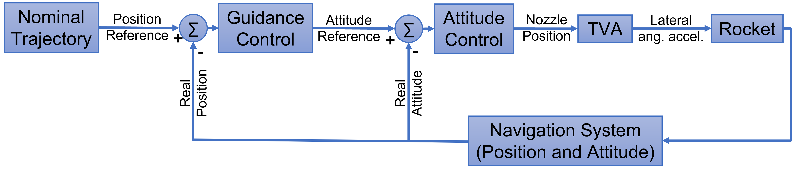
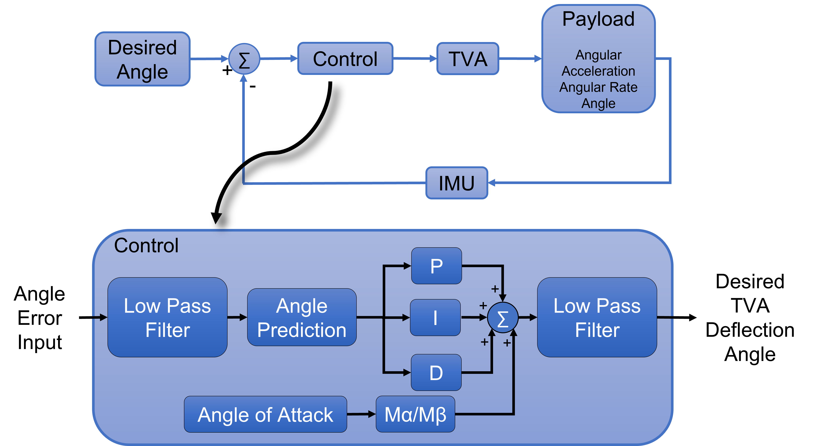

# VS-50 Supplementary Material Repository

## Robust Attitude and Guidance Control for a Launch Vehicle System: A Lyapunov-LMI Framework with HIL Validation

This repository contains supplementary material for the journal paper:

**"Robust Attitude and Guidance Control for a Launch Vehicle System: A Lyapunov-LMI Framework with HIL Validation"**

**Authors:** Roberto Brusnicki (TUM), Cesar Batagini (IAE), Josef Ettl (DLR), Renan Lima Pereira (ITA)  
**Journal:** International Journal of Aeronautical and Space Sciences  
**Status:** Under Review  
**Year:** 2025  

## 📋 Repository Overview

This repository provides high-resolution figures, detailed analysis results, and comprehensive technical documentation that could not be included in the journal paper due to space constraints. All materials are organized systematically to complement the published research and provide deeper insights into the methodology and results.

### 🚀 Project Background

The VS-50 is a suborbital launch vehicle developed through Brazilian-German cooperation between IAE (Instituto de Aeronáutica e Espaço) and DLR (Deutsches Zentrum für Luft- und Raumfahrt). This research presents robust control strategies using Linear Matrix Inequality (LMI) synthesis for attitude and guidance control systems, with comprehensive Hardware-in-the-Loop validation.

## 📁 Repository Structure

```
VS50-Supplementary-Material/
├── Chapter-01-Introduction/          (1 figure)
├── Chapter-02-Literature-Review/     (7 figures)  
├── Chapter-03-Mathematical-Modeling/ (28 figures)
├── Chapter-04-Results-and-Analysis/  (27 figures)
├── Annex-A-Bode-Plots/              (15 figures)
├── Annex-B-Worst-Case-Scenarios/    (10 figures)
├── README.md                         (this file)
├── PDF-to-LaTeX-Figure-Mapping.md    (technical mapping)
└── REORGANIZATION-STEPS.md           (organization guide)
```

**Total: 88 High-Resolution Figures**

## 📖 Chapter Contents

<details>
<summary> <h3> 📚 Chapter 1: Introduction </h3> </summary>

**Content**: Research motivation, problem formulation, control objectives, VS-50 launch vehicle system overview

#### Figure 1.1: VS-50 Launch Vehicle
<p align="center">

</p>

**Caption:** VS-50 launch vehicle.

This Brazilian-German cooperative suborbital launch vehicle serves as the test platform for advanced robust control methodologies presented in this research.

</details>

<details>
<summary> <h3> 🔍 Mathematical modeling for the VS-50 vehicle </h3> </summary>

**Content**: State-of-the-art review in launch vehicle control, reference coordinate systems, fundamental mathematical concepts

#### Figure 2.1: IAE Flight Dynamics Reference Systems
<p align="center">

</p>

**Caption:** IAE flight dynamics reference systems.

#### Figure 2.2: DLR Body and Navigation Reference Systems
<p align="center">

</p>

**Caption:** DLR body reference system (BRS) and navigation reference system (NRS) at launchpad.

#### Figure 2.3: Thrust Force Vector
<p align="center">

</p>

**Caption:** Thrust force vector with respect to the body reference system.

#### Figure 2.4: WGS-84 Ellipsoid Reference
<p align="center">

</p>

**Caption:** Ellipsoid reference used for WGS-84.

#### Figure 2.5: Payload and Speed Vectors in NRS
<p align="center">

</p>

**Caption:** The payload vector $\vec{r}$ and the speed vector $\vec{v}$ represented in the NRS.

#### Figure 2.6: Euler Angles of Rotations
<p align="center">

</p>

**Caption:** Euler angles of rotations used to describe rocket's attitude and the velocity vector attitude.

#### Figure 2.7: Aerodynamic Forces Directions
<p align="center">

</p>

**Caption:** Aerodynamic forces directions due to the given payload vector $\vec{r}$ and speed vector $\vec{v}$.

</details>

<details>
<summary> <h3> ⚙️ Attitude and Guidance Control </h3> </summary>

**Content**: Complete mathematical model, control system design, LMI synthesis methodology, Hardware-in-the-Loop setup

<p align="center">

</p>

<p align="center"><strong>Control loop block diagram</strong></p>

<br>

<p align="center">

</p>

<p align="center"><strong>Control loops and respective cutoff frequencies</strong></p>

<br>

<p align="center">

</p>

<p align="center"><strong>Attitude control with focus on controller schematic</strong></p>

<br>

<p align="center">

</p>

<p align="center"><strong>Different control phases during the boosted phase of VS-50 from Alcântara</strong></p>

<br>

<details>
<summary> <h4> &nbsp;&nbsp;&nbsp;&nbsp;3.1 Vehicle and its subsystems </h4> </summary>

<details>
<summary> <h5> &nbsp;&nbsp;&nbsp;&nbsp;&nbsp;&nbsp;&nbsp;&nbsp;3.1.1 INS system </h5> </summary>

<p align="center">

</p>

<p align="center"><strong>DMARS transfer function</strong></p>

<br>

<p align="center">

</p>

<p align="center"><strong>Bode diagram of INS system (DMARS)</strong></p>

<br>

<p align="center">

</p>

<p align="center"><strong>DMARS reference system</strong></p>

<br>

<p align="center">

</p>

<p align="center"><strong>DMARS with axes-label</strong></p>

<br>

</details>

<details>
<summary> <h5> &nbsp;&nbsp;&nbsp;&nbsp;&nbsp;&nbsp;&nbsp;&nbsp;3.1.2 TVA system </h5> </summary>

<p align="center">

</p>

<p align="center"><strong>TVA transfer function</strong></p>

<br>

<p align="center">

</p>

<p align="center"><strong>Bode diagram of TVA plant</strong></p>

<br>

</details>

<details>
<summary> <h5> &nbsp;&nbsp;&nbsp;&nbsp;&nbsp;&nbsp;&nbsp;&nbsp;3.1.3 Rocket system </h5> </summary>

<p align="center">

</p>

<p align="center"><strong>Rocket's dynamic schematics</strong></p>

<br>

<p align="center">

</p>

<p align="center"><strong>Bode diagram of simplest version of the rocket's plant</strong></p>

<br>

</details>

<details>
<summary> <h5> &nbsp;&nbsp;&nbsp;&nbsp;&nbsp;&nbsp;&nbsp;&nbsp;3.1.4 Dead times </h5> </summary>

*Dead time analysis and modeling - figures available in complete collection*

</details>

<details>
<summary> <h5> &nbsp;&nbsp;&nbsp;&nbsp;&nbsp;&nbsp;&nbsp;&nbsp;3.1.5 Low pass filter </h5> </summary>

<p align="center">

</p>

<p align="center"><strong>Low pass filter transfer function</strong></p>

<br>

<p align="center">

</p>

<p align="center"><strong>Bode diagram of the 2nd order low pass filter</strong></p>

<br>

</details>

</details>

<details>
<summary> <h4> &nbsp;&nbsp;&nbsp;&nbsp;3.2 Design of the gain-scheduled PID controllers </h4> </summary>

<details>
<summary> <h5> &nbsp;&nbsp;&nbsp;&nbsp;&nbsp;&nbsp;&nbsp;&nbsp;3.2.1 Conventional attitude controller </h5> </summary>

<p align="center">

</p>

<p align="center"><strong>Attitude open loop bode diagrams</strong></p>

<br>

<p align="center">

</p>

<p align="center"><strong>How the gains of the PID controller changes during the boosted phase of VS-50</strong></p>

<br>

<p align="center">

</p>

<p align="center"><strong>Block diagram for the output-feedback PID control</strong></p>

<br>

</details>

<details>
<summary> <h5> &nbsp;&nbsp;&nbsp;&nbsp;&nbsp;&nbsp;&nbsp;&nbsp;3.2.2 Proposed attitude controller via LMI synthesis </h5> </summary>

<p align="center">

</p>

<p align="center"><strong>Estimation of M<sub>α</sub> versus M<sub>β</sub> over time</strong></p>

<br>

<p align="center">

</p>

<p align="center"><strong>Polytope that includes all M<sub>α</sub> and M<sub>β</sub> values, even with ±20% variation</strong></p>

<br>

<p align="center">

</p>

<p align="center"><strong>Scheduled PID gains obtained for the robust attitude controller</strong></p>

<br>

</details>

<details>
<summary> <h5> &nbsp;&nbsp;&nbsp;&nbsp;&nbsp;&nbsp;&nbsp;&nbsp;3.2.3 Conventional guidance controller </h5> </summary>

<p align="center">

</p>

<p align="center"><strong>Overview of guidance control loop</strong></p>

<br>

<p align="center">

</p>

<p align="center"><strong>Bode diagram for open loop guidance control - normalized version (M<sub>γ</sub>=1)</strong></p>

<br>

<p align="center">

</p>

<p align="center"><strong>Guidance PD gains over time</strong></p>

<br>

</details>

<details>
<summary> <h5> &nbsp;&nbsp;&nbsp;&nbsp;&nbsp;&nbsp;&nbsp;&nbsp;3.2.4 Proposed guidance controller via LMI synthesis </h5> </summary>

<p align="center">

</p>

<p align="center"><strong>Variation of M<sub>γ</sub> over time</strong></p>

<br>

<p align="center">

</p>

<p align="center"><strong>Guidance gains obtained for the elevation</strong></p>

<br>

</details>

</details>

<details>
<summary> <h4> &nbsp;&nbsp;&nbsp;&nbsp;3.3 Hardware-in-the-loop simulations using LABVIEW </h4> </summary>

<p align="center">

</p>

<p align="center"><strong>Hardware in the loop test overview</strong></p>

<br>

<details>
<summary> <h5> &nbsp;&nbsp;&nbsp;&nbsp;&nbsp;&nbsp;&nbsp;&nbsp;3.3.1 Rocket Plant hardware </h5> </summary>

<p align="center">

</p>

<p align="center"><strong>National Instruments PXI</strong></p>

<br>

</details>

<details>
<summary> <h5> &nbsp;&nbsp;&nbsp;&nbsp;&nbsp;&nbsp;&nbsp;&nbsp;3.3.2 Motion simulation table </h5> </summary>

<p align="center">

</p>

<p align="center"><strong>Three axis motion simulator model AC3350</strong></p>

<br>

</details>

<details>
<summary> <h5> &nbsp;&nbsp;&nbsp;&nbsp;&nbsp;&nbsp;&nbsp;&nbsp;3.3.3 Inertial Measurement Unit </h5> </summary>

*DMARS IMU integration details - see section 3.1.1 for DMARS system figures*

</details>

<details>
<summary> <h5> &nbsp;&nbsp;&nbsp;&nbsp;&nbsp;&nbsp;&nbsp;&nbsp;3.3.4 Software description </h5> </summary>

<p align="center">

</p>

<p align="center"><strong>Data flow of PXI computer</strong></p>

<br>

<p align="center">

</p>

<p align="center"><strong>Simulation settings in the front panel user interface</strong></p>

<br>

<p align="center">

</p>

<p align="center"><strong>Serial communication information in the front panel user interface</strong></p>

<br>

</details>

</details>

*Total: 31 high-resolution figures covering mathematical modeling, control design, and HIL validation*

</details>

<details>
<summary> <h3> 📊 Chapter 4: Results and Analysis </h3> </summary>

**Content**: Comprehensive results comparing current vs. proposed controllers, frequency and time domain analysis, robustness verification

#### Performance Comparison Results
*Detailed analysis comparing classical PID control with proposed LMI-based robust controllers across various flight conditions and parameter uncertainties*

#### Frequency Domain Analysis  
*Bode plots, stability margins, and robustness analysis for attitude and guidance control systems*

#### Time Domain Validation
*Step responses, tracking performance, and disturbance rejection capabilities under realistic flight scenarios*

*Total: 27 high-resolution figures covering comprehensive performance analysis*

</details>

<details>
<summary> <h3> 📈 Annex A: Additional Bode Plots </h3> </summary>

**Content**: Detailed frequency response analysis, closed-loop Bode plots, controller comparisons across all flight phases

#### Closed-Loop Frequency Analysis
*Comprehensive Bode plot analysis for various controller configurations and flight conditions*

#### Controller Performance Comparison
*Detailed frequency domain comparison between current and robust control approaches*

*Total: 15 high-resolution Bode plots for comprehensive frequency domain analysis*

</details>

<details>
<summary> <h3> ⚠️ Annex B: Worst Case Scenarios </h3> </summary>

**Content**: Mission performance under extreme conditions, worst-case disturbance analysis, robustness verification

#### Extreme Condition Testing
*Controller performance under maximum parameter uncertainties, worst-case wind disturbances, and extreme flight conditions*

#### Robustness Verification
*Validation of controller robustness under challenging scenarios that test the limits of the control system*

*Total: 10 high-resolution figures demonstrating controller performance under worst-case conditions*

</details>

<details>
<summary> <h2> 🛠️ Technical Highlights </h2> </summary>

### Control Methodologies
- **LMI-based Robust Control**: Lyapunov stability guarantees
- **Gain Scheduling**: Adaptation to varying flight conditions  
- **H∞ Control**: Disturbance rejection and robustness
- **PID Control**: Baseline comparison and implementation

### Validation Approach
- **Hardware-in-the-Loop (HIL)**: Real-time validation using actual flight hardware
- **Monte Carlo Simulations**: Statistical performance assessment
- **Worst-Case Analysis**: Robustness verification under extreme conditions

### Key Technologies
- **DMARS Navigation System**: High-precision inertial navigation
- **TVA (Thrust Vector Actuator)**: Primary attitude control actuator
- **Real-Time Implementation**: LabVIEW-based control system

</details>

<details>
<summary> <h2> 📊 Key Results </h2> </summary>

### Performance Improvements
- **Enhanced Robustness**: Superior performance under parameter uncertainties
- **Improved Tracking**: Better attitude and guidance response
- **Extended Stability Margins**: Increased phase and gain margins
- **Validated Performance**: Confirmed through HIL testing

### Innovation Contributions
1. **LMI Synthesis Framework**: Systematic robust controller design
2. **Integrated HIL Validation**: Real hardware testing methodology  
3. **Comprehensive Analysis**: Complete frequency and time domain evaluation
4. **Practical Implementation**: Ready-to-deploy control algorithms

</details>

## 🔗 Main Publication

### Journal Paper
**Title:** "Robust Attitude and Guidance Control for a Launch Vehicle System: A Lyapunov-LMI Framework with HIL Validation"

**Authors:** 
- Roberto Brusnicki (TUM)
- Cesar Batagini (IAE) 
- Josef Ettl (DLR)
- Renan Lima Pereira (ITA)

**Journal:** International Journal of Aeronautical and Space Sciences (Under Review)

<details>
<summary> <h2> 📚 How to Use This Repository </h2> </summary>

### For Researchers
1. **Reference Figures**: All figures are organized systematically with detailed descriptions
2. **High-Resolution Access**: Download original image files for presentations/papers
3. **Detailed Analysis**: Explore comprehensive results beyond journal paper constraints
4. **Methodology Understanding**: Review complete mathematical models and control architectures

### For Students
1. **Learning Resource**: Study control system design methodologies
2. **Implementation Guide**: Reference HIL setup and validation procedures  
3. **Mathematical Foundation**: Access detailed modeling equations and derivations
4. **Performance Analysis**: Understand robustness evaluation techniques

### For Industry
1. **Control Algorithms**: Reference robust control design procedures
2. **Validation Methods**: HIL testing protocols and procedures
3. **Performance Metrics**: Evaluation criteria and benchmarking approaches
4. **Implementation Guidelines**: Practical deployment considerations

</details>

## 🏛️ Institutional Acknowledgments

### Academic Institutions
- **ITA (Instituto Tecnológico de Aeronáutica)** - Brazil
- **TUM (Technical University of Munich)** - Germany  
- **IAE (Instituto de Aeronáutica e Espaço)** - Brazil
- **DLR (Deutsches Zentrum für Luft- und Raumfahrt)** - Germany

### Project Collaboration
This work was conducted under the Brazilian-German cooperation in space technology, specifically within the VS-50 suborbital launch vehicle development program.

## 📄 Citation

If you use this material in your research, please cite:

```bibtex
@article{brusnicki2025robust,
  title={Robust Attitude and Guidance Control for a Launch Vehicle System: A Lyapunov-LMI Framework with HIL Validation},
  author={Brusnicki, Roberto and Batagini, Cesar and Ettl, Josef and Pereira, Renan Lima},
  journal={International Journal of Aeronautical and Space Sciences},
  year={2025},
  status={Under Review},
  note={Supplementary material available at: https://github.com/YOUR_USERNAME/VS50-Supplementary-Material}
}
```

## 📞 Contact

**Roberto Brusnicki**  
- 📧 Email: [roberto.brusnicki@tum.de]
- 🔗 LinkedIn: [linkedin.com/in/roberto-brusnicki]
- 🎓 Institution: Technical University of Munich (TUM)

## 📝 License

This repository is provided for academic and research purposes. Please refer to the individual figure sources and respect copyright restrictions when using materials for publications.

---

**Last Updated:** June 2025  
**Repository Version:** 1.0  
**Total Figures:** 88  
**Paper Status:** Under Review 